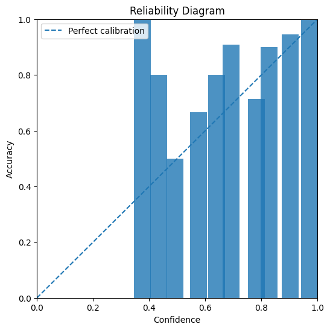
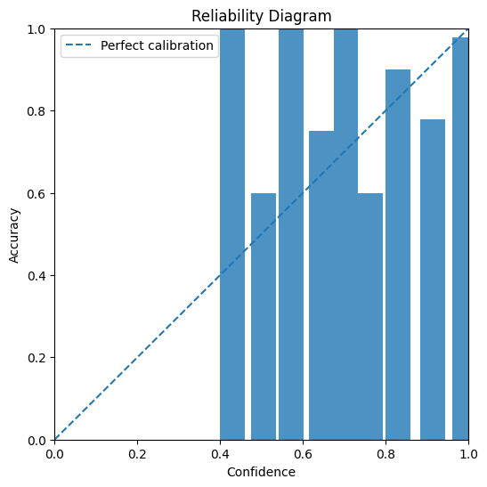
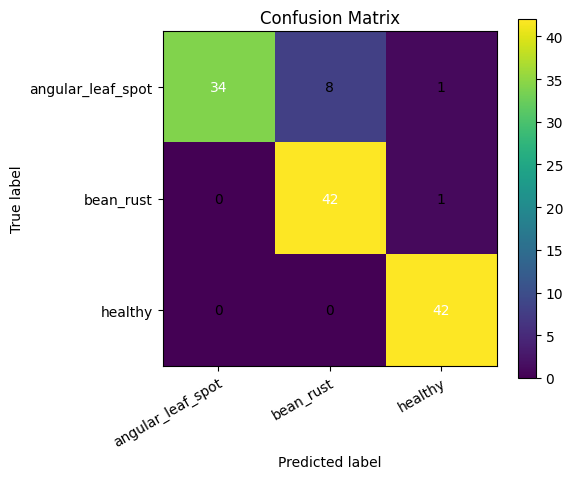

# Bean Leaf Disease Classifier

A compact image-classification project for the Hugging Face `beans` dataset that trains an EfficientNet-B0 classifier in PyTorch, calibrates prediction confidence with JAX temperature scaling, and tracks experiments with MLflow.

## Overview

This project trains a 3-class bean leaf disease classifier on the Hugging Face `beans` dataset.

Core pieces:
- **Model:** `torchvision` EfficientNet-B0 with a replaced classifier head
- **Training:** PyTorch training loop with augmentation, backbone freezing, validation tracking, and early stopping
- **Calibration:** post-hoc temperature scaling implemented in JAX on validation logits
- **Experiment tracking:** MLflow parameters, metrics, artifacts, and model logging
- **Inference:** standalone prediction script that uses the saved PyTorch weights plus a serving config containing calibration metadata

## Classes

The dataset classes come from the Hugging Face `beans` dataset and are loaded directly from dataset metadata at runtime.

## Repository structure

```text
beans-disease-ml/
├── configs/
│   └── config.yaml            # Training configuration
├── outputs/                   # Local outputs written by training
├── mlruns/                    # Local MLflow tracking directory
├── run_train.py               # CLI entrypoint for training
├── predict.py                 # CLI entrypoint for single-image inference
├── requirements.txt
└── src/
    ├── config.py              # Dataclass config loader
    ├── data.py                # HF dataset loading + torchvision transforms
    ├── inference.py           # Model loading and prediction pipeline
    ├── jax_calibration.py     # Temperature scaling with JAX
    ├── metrics.py             # ECE, confusion matrix, reliability plots
    ├── model.py               # EfficientNet-B0 construction + freeze helpers
    ├── train.py               # End-to-end training / evaluation pipeline
    └── utils.py               # Seed, device, directory, softmax helpers
```

## Features

- Uses pretrained **EfficientNet-B0** weights from `torchvision`
- Replaces the classifier with `Dropout + Linear`
- Freezes the backbone first, then unfreezes all layers after a configurable number of epochs
- Applies image augmentation during training
- Tracks:
  - loss
  - accuracy
  - macro F1
  - expected calibration error (ECE)
- Saves:
  - best model checkpoint
  - classification report
  - confusion matrix
  - reliability diagrams
  - serving config for inference
  - MLflow model artifact

## Configuration

Default config: `configs/config.yaml`

```yaml
experiment_name: beans-leaf-disease-portfolio
run_name: efficientnetb0-pytorch-jax-calibration
seed: 42
image_size: 224
batch_size: 32
num_workers: 2
epochs: 6
lr: 0.0003
weight_decay: 0.0001
dropout: 0.2
freeze_backbone_epochs: 1
early_stopping_patience: 3
mlflow_tracking_uri: mlruns
output_dir: outputs
```

### What the config controls

- `image_size`: resize target for input images
- `batch_size`: dataloader batch size
- `epochs`: max training epochs
- `freeze_backbone_epochs`: number of initial epochs where only the classifier trains
- `early_stopping_patience`: stop if validation macro F1 stops improving
- `mlflow_tracking_uri`: local MLflow run store
- `output_dir`: local directory for reports, plots, model weights, and serving config

## Installation

Create a Python environment and install dependencies:

```bash
pip install -r requirements.txt
```

Main dependencies:
- PyTorch
- Torchvision
- Datasets
- MLflow
- JAX / jaxlib
- scikit-learn
- matplotlib
- Pillow
- PyYAML

## Training

Run training with the default config:

```bash
python run_train.py --config configs/config.yaml
```

### Training pipeline

1. Load the Hugging Face `beans` dataset
2. Build train / validation / test dataloaders
3. Initialize EfficientNet-B0 with pretrained weights
4. Freeze backbone parameters initially
5. Train and evaluate each epoch
6. Save the best checkpoint using validation macro F1
7. Reload the best checkpoint
8. Collect validation logits and fit a **temperature scaler** in JAX
9. Evaluate test performance before and after calibration
10. Save artifacts and log everything to MLflow

## Inference

Predict on a single image:

```bash
python predict.py   --image path/to/image.jpg   --model outputs/best_model.pt   --serving-config outputs/serving_config.json
```

### Prediction output

The prediction script returns JSON like:

```json
{
  "predicted_class": "angular_leaf_spot",
  "confidence": 0.97,
  "class_probabilities": {
    "angular_leaf_spot": 0.97,
    "bean_rust": 0.02,
    "healthy": 0.01
  }
}
```

The serving config stores:
- class names
- learned temperature
- image size
- normalization mean/std

## Training results

### Per-epoch metrics

| Epoch | Train Loss | Train Acc | Train Macro F1 | Val Loss | Val Acc | Val Macro F1 |
|---|---:|---:|---:|---:|---:|---:|
| 1 | 1.0273 | 0.4990 | 0.4960 | 0.8986 | 0.7068 | 0.6919 |
| 2 | 0.7699 | 0.7456 | 0.7454 | 0.5278 | 0.7970 | 0.7926 |
| 3 | 0.4988 | 0.8530 | 0.8526 | 0.3276 | 0.8797 | 0.8763 |
| 4 | 0.3115 | 0.9043 | 0.9042 | 0.2179 | 0.9549 | 0.9543 |
| 5 | 0.2128 | 0.9410 | 0.9410 | 0.1635 | 0.9474 | 0.9466 |
| 6 | 0.1534 | 0.9536 | 0.9536 | 0.1498 | 0.9398 | 0.9389 |

## Reliability 
This graph visualizes behavior under uncalibrated reliability: 



This graph visualizes behavior under calibrated reliability: 



These graphs reveal that:

- The calibrated model’s confidence scores align more closely with observed accuracy.
- Calibration improved confidence reliability without affecting classification quality. 

## Confusion Matrix 



This confusion matrix reveals that: 
- The model is strongest on healthy and bean_rust: it correctly classifies 42/42 healthy (100%) and 42/43 bean_rust (97.7%) samples, with almost no confusion between those classes.
- The main weakness is angular_leaf_spot, where 34/43 (79.1%) are correct and most errors are predicted as bean_rust (8 cases), making that the key confusion to focus on improving.

## MLflow outputs

During training, the pipeline logs:
- config parameters
- per-epoch metrics
- best checkpoint artifact
- calibrated classification report
- confusion matrix
- calibrated and uncalibrated reliability diagrams
- serving config
- serialized PyTorch model
- run summary

Default local tracking directory:

```text
mlruns/
```

## Saved files

Expected local output files include:

```text
outputs/
├── best_model.pt
├── classification_report_calibrated.json
├── confusion_matrix.png
├── reliability_calibrated.png
├── reliability_uncalibrated.png
├── run_summary.json
└── serving_config.json
```

## Implementation details

### Data pipeline

`src/data.py`:
- loads the `beans` dataset with `datasets.load_dataset("beans")`
- uses train-time augmentation:
  - resize
  - random horizontal flip
  - random rotation
  - color jitter
  - normalization with ImageNet stats
- uses deterministic evaluation transforms for validation and test

### Model

`src/model.py` builds EfficientNet-B0 with pretrained weights and swaps the classifier for:

```python
nn.Sequential(
    nn.Dropout(p=dropout),
    nn.Linear(in_features, num_classes),
)
```

### Calibration

`src/jax_calibration.py` fits a single temperature parameter by minimizing validation negative log-likelihood in JAX, then applies that temperature to test logits and inference logits.

### Metrics and artifacts

`src/metrics.py` provides:
- expected calibration error (ECE)
- confusion matrix plotting
- reliability diagram plotting


